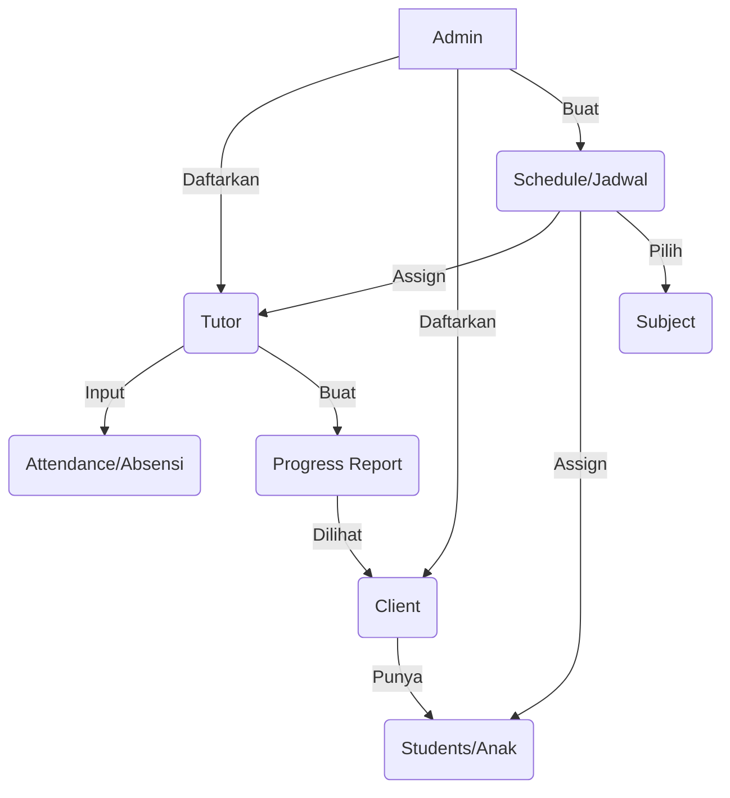

# 🔄 Sistem Bimbel - Workflow & Business Logic

Dokumen ini menjelaskan alur kerja utama dan logika bisnis yang diterapkan dalam sistem "Missi Private Course" setelah pembaruan sistem penggajian dan manajemen jenjang.

---

## 🏗️ 1. Struktur Data Master
Sebelum operasional dimulai, Admin mengelola data master berikut:

1.  **Grade Levels (Jenjang)**: Master data jenjang pendidikan (PAUD, SD, SMP, SMA, dll) yang tersimpan di database.
2.  **Subjects (Mata Pelajaran)**: Mata pelajaran yang dikaitkan dengan salah satu *Grade Level*.
3.  **Users**: Pendaftaran akun untuk Tutor dan Client.

---

## 📚 2. Alur Akademik (Learning Flow)

---

## 💰 3. Alur Keuangan & Penggajian (Payroll Flow)

Sistem menggunakan model **Profit Sharing Tetap** (Fixed Rate).

### 💵 Logika Per Sesi:
-   **Harga ke Client**: Rp 50.000 / Sesi
-   **Gaji Tutor**: Rp 40.000 / Sesi
-   **Margin Perusahaan**: Rp 10.000 / Sesi

### 🔄 Alur Payroll:
1.  **Sesi Selesai**: Tutor mengisi absensi dan laporan sesi yang telah selesai.
2.  **Generate Payroll**: Di akhir periode (bulan), Admin menekan tombol **Generate Payroll**.
3.  **Kalkulasi Otomatis**:
    -   Sistem menghitung total sesi dengan status `Completed` pada periode tersebut.
    -   `Total Gaji = Jumlah Sesi × Rp 40.000`.
    -   Bonus/Potongan diset `0` secara default (Simplified Mode).
4.  **Verifikasi & Pembayaran**: Admin memeriksa rincian (Breakdown) dan memproses pembayaran ke Tutor.

---

## 🛠️ 4. Peran Pengguna (Role Capabilities)

### 👑 Admin
-   **Full Access**: Mengelola semua data master (Jenjang, Mapel, User).
-   **Operations**: Mengatur jadwal, verifikasi pembayaran client, dan generate gaji tutor.
-   **Monitoring**: Melihat laporan perkembangan semua siswa.

### 👩‍🏫 Tutor
-   **Dashboard**: Melihat jadwal mengajar mendatang.
-   **Reporting**: Mengisi absensi dan laporan perkembangan siswa setiap selesai sesi.
-   **Earnings**: Melihat riwayat gaji dan status pembayaran.

### 👨‍👩‍👧 Client (Orang Tua)
-   **Monitoring**: Melihat jadwal anak dan laporan perkembangan dari tutor.
-   **Students**: Mengelola data anak yang didaftarkan.
-   **Payments**: Melihat tagihan dan melakukan konfirmasi pembayaran.

---

## ⚙️ 5. Aturan Bisnis (Business Rules)
1.  **Status Jadwal**: Hanya sesi dengan status `Completed` yang masuk ke hitungan gaji.
2.  **Satu Gaji Per Bulan**: Sistem mencegah duplikasi generate gaji untuk tutor yang sama di periode bulan yang sama.
3.  **Manajemen Jenjang**: Jenjang tidak bisa dihapus jika masih memiliki mata pelajaran aktif untuk menjaga integritas data.

---
*Terakhir diperbarui: 30 April 2026*
